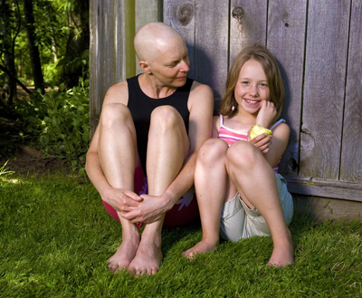
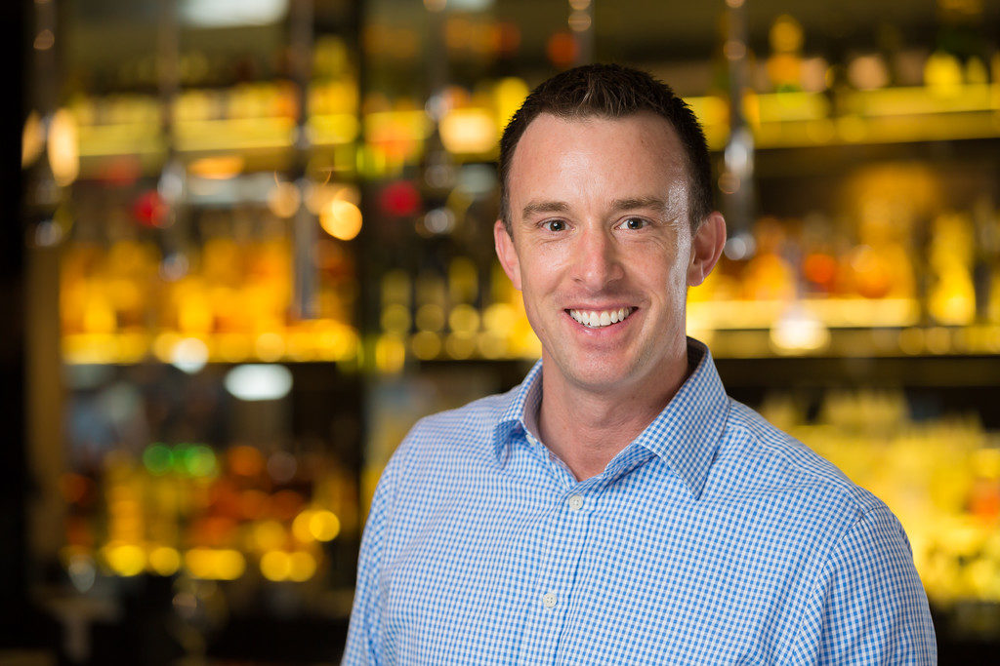
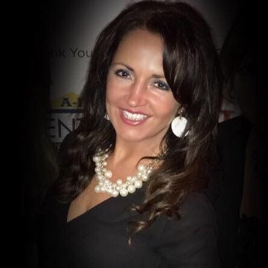
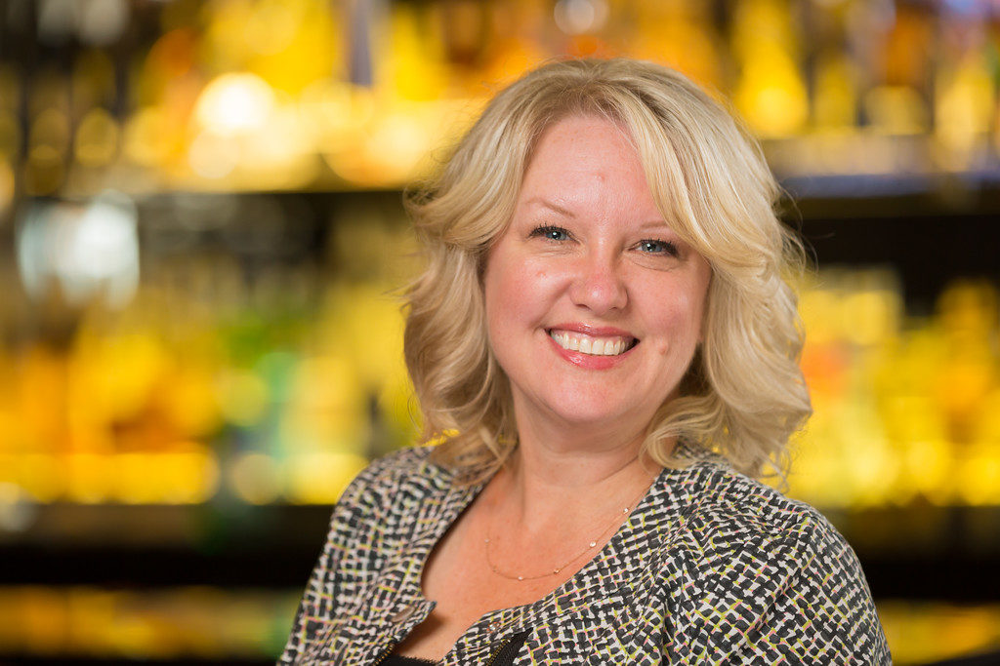
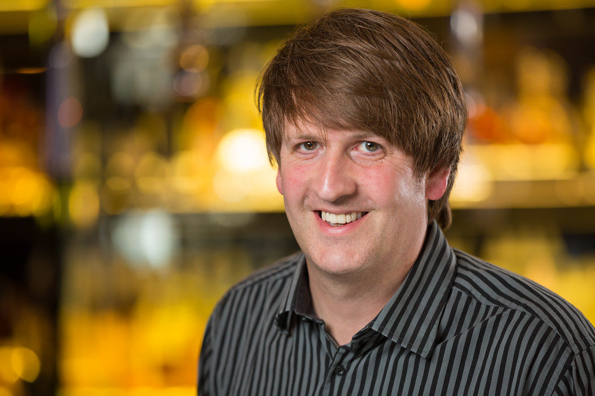

import FadeIn from "../components/FadeIn.astro";

{/* prettier-ignore */}
<h1 class="mb-6 font-serif text-5xl text-[#2B2B40] md:text-6xl">
  About Us
</h1>

  

    ## Our Mission 
    Our mission is to bring comfort, dignity, and hope to
    individuals facing late stage cancer by helping make meaningful moments
    possible when they matter most. We exist to remove barriers such as physical
    limitations, logistics, and financial strain so cancer warriors and their
    loved ones can share one more special experience together. Whether simple or
    significant, these moments honor a life, strengthen human connection, and
    offer families memories that endure long after words fall short. Through
    compassion, community support, and thoughtful action, we strive to transform
    helplessness into hope by giving families the chance to create one more
    moment they will cherish forever.
  

  

## Our Story

Jason and his mother regularly visited the local coffee shop to spend time together and catch up on life’s adventures. It was something just the two of them shared and they both looked forward to it each week throughout the years.

One day in September 2013, she looked at him and mumbled a familiar request:

> “Do you want to go and grab a cup of coffee?”

The advanced cancer had rendered her body weak, tired and all but immobile. She required assistance for sitting up, a wheelchair to move greater distances and oxygen tank to breath. Jason knew grabbing coffee would be no small task as getting her out of the house would be impossible without the assistance of others.

When she died a few days later, the feeling of helplessness in that moment stayed with Jason.

Knowing he didn’t have the resources to provide his mother one last coffee date broke his heart. Something so simple that they had shared so many times was now unobtainable forevermore.

It is out of that sense of helplessness that One More Moment was founded. To give hope in a time of need and provide last “moments” which cancer fighters and their families will cherish forever.

## What We Do

One More Moment is a 501(c)(3) nonprofit located in Ann Arbor created to help give local late stage cancer warriors and their families an opportunity to have one more special moment together. To some, like Jason and his mother, it could be a cup of coffee at a local shop; to others it could be one last trip to Lake Michigan, one more football game, one more picnic in a park, a visit to sentimental place, or a drive to see the sunset. They needn’t be extreme or “typical”. The key is for something special and unique for every individual & family; simply “their” moment to enjoy.

Through our vast network of resources and generous donors & supporters, we work hand-in-hand with local organizations to ensure that late stage cancer warriors have their One More Moment.## Our Team

<iframe
  className="aspect-video w-full"
  src="https://youtube.com/embed/BP8g7k7Y28E"
  title="YouTube Video Player"
  allow="accelerometer; autoplay; clipboard-write; encrypted-media; gyroscope; picture-in-picture"
  loading="lazy"
  referrerpolicy="strict-origin-when-cross-origin"
/>

## Our Team

{/* prettier-ignore */}

  <FadeIn client:load>
    

      

        
      

      

      ### Jason Pohlonski 
      After losing his mother to cancer in September of
      2013, Jason wanted to make a difference in the lives of cancer warriors.
      When he wasn’t able to provide his mother the simple last wish of going
      out for coffee, he knew there were others in the same situation. Since
      that day, Jason has worked tirelessly to provide late stage cancer
      warriors with their wish or moment.
    

  

  </FadeIn>
  <FadeIn client:load>
  

    

      ### Simone Goga
      Since arriving in the United State from Eastern Europe in
      the 2nd Grade, Simone has been local to the Ann Arbor. Her passion for
      helping people, her strong faith, and her outgoing and uplifting
      personality has given her many opportunities over the years to connect
      with people of all ages, backgrounds with various personal life
      experiences. Simone lives by the belief that life is meant to be truly
      “lived”; that a written “vision” is more important that spoken goals, and
      that nothing is more powerful than a human soul on fire. That fire
      connected her with Jason and Ashley. But her passion for helping cancer
      patients and their loved ones to have one more moment together - gives her
      the energy to work and support the foundation and the exciting events,
      while still being a full-time working mom, a wife, a daughter, a sister to
      her 4 siblings, and a loyal friend to many. Simone also lost her beautiful
      aunt to cancer in March of 2015, as well as 2 close friends years back and
      she believes that the One More Moment Foundation is something that will
      help toward finding a cure for this dreadful disease, while in the
      meantime, it will help those suffering feel just a little more loved and
      special while still on this earth.
    

    

      
    

  

  </FadeIn>
  <FadeIn client:load>
  

    

    

      ### Carrie House 
      Carrie brings a wealth of experience and compassion to
      our team. Her dedication to supporting families during difficult times has
      been instrumental in growing our network of partners. Whether coordinating
      events or meeting with warriors, Carrie’s warm presence ensures that
      everyone feels heard and valued. She is committed to making every moment
      count for the families we serve.
    

  

  </FadeIn>
  <FadeIn client:load>
  

    

      ### Andy Thompson 
      Andy Thompson earned his Bachelor’s Degree in
      Advertising at Ferris State University. As a graphic designer he has
      worked on a variety of projects, ranging from print, digital and direct
      mail advertising to logos, business cards, apparel, and vehicle wraps. His
      past clients include Necto Nightclub, the World Animal Awareness Society,
      and the Ann Arbor Convention & Visitor’s Bureau. He enjoys movies and
      concerts, and lives in Ypsilanti with his wife and several special needs
      pets.
    

    

      
    

  

  </FadeIn>

